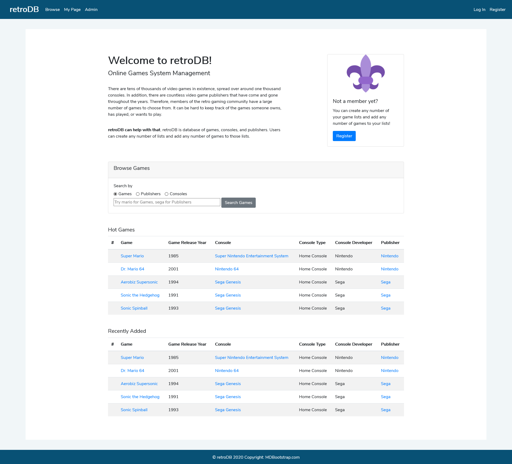
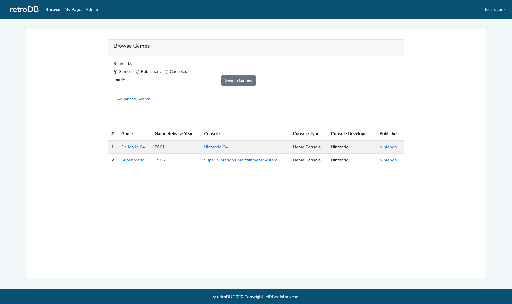
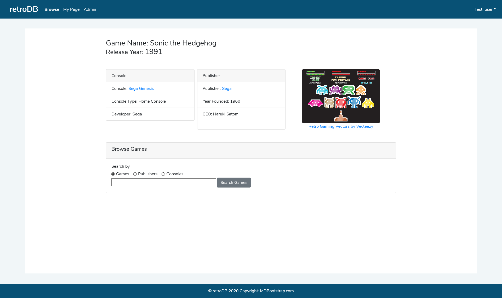
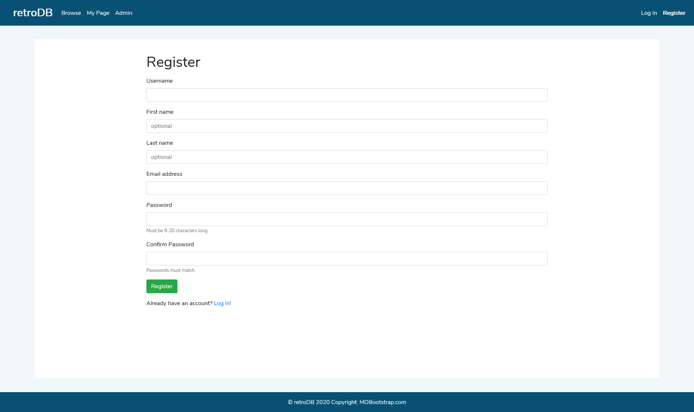
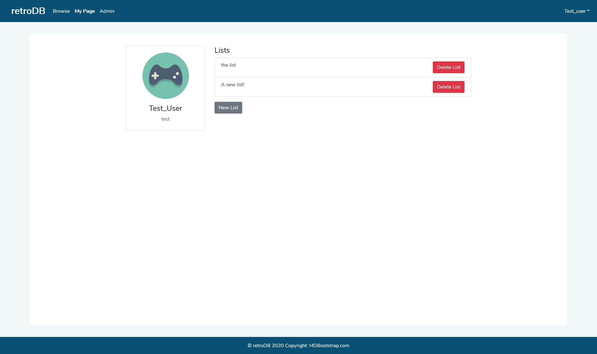
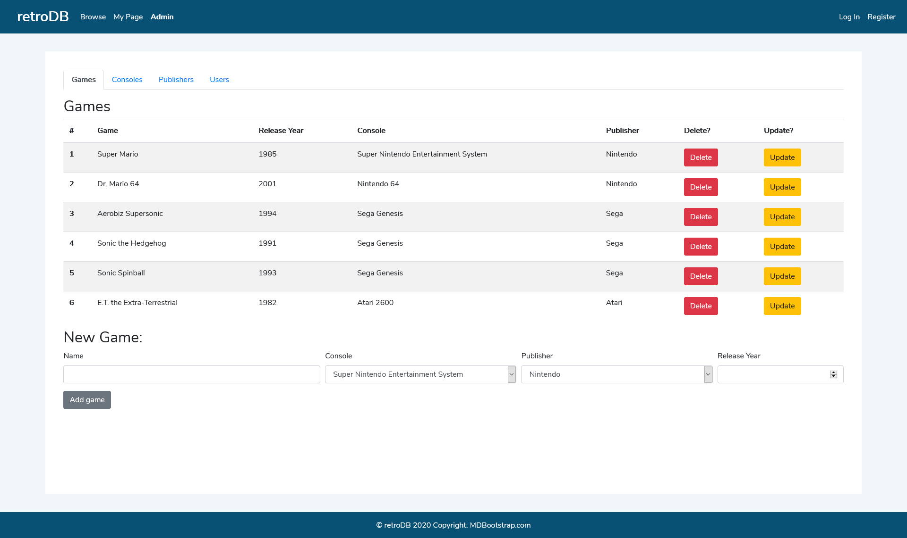

# retroDB

## About
retroDB is a web application that allows users to browse a database of games, consoles and publishers. Users can also create accounts and make lists of games. These lists can be favorites, want-to-play, or whatever the user wants.

## To run locally
In order to run this locally, you will need to link to your own SQL database. You can do this using dbcon.js in the root folder. After that, you can simply run `node app.js`, and go to `localhost:[port number]` in your preferred web browser.

## Website images
The website is not accessible outside of Oregon State. Here are some images to give you an idea of what the website looks like. Be sure to visit the docs folder to see all images of the website!

### Home Page

### Results Page

### Game Page

### Register Page

### User Page

### Admin Page, games section
